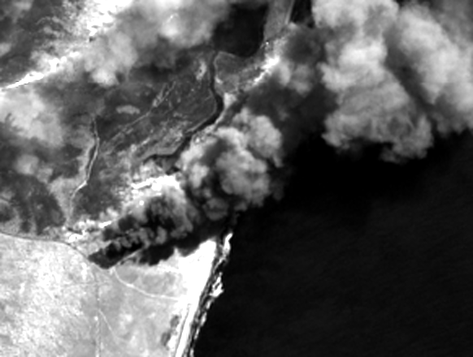

# Sentinel-2: [Chronoscope](https://en.wikipedia.org/wiki/The_Dead_Past)
A tool for generating ~2.5 sec animated gif from a single Sentinel-2 scene.

## Disclaimer
This tool was inspired by [Samuel Bancroft](https://twitter.com/Spiruel)'s [work](https://twitter.com/Spiruel/status/1331279630037299200).

## Build image
```sh
docker build -t sentinel2-chronoscope .
```

## Usage
Given 1) Sentinel-2 L2A scene path, 2) frame rate (default set to 3 fps), 3) spatial window (Xmin Ymin Xmax Ymax), and 4) path to output directory (default set to `output`), this tool generates a 2.5-second-long video written to `<OUTPUT>/scene.gif`.

```sh
docker run --rm -it -v `pwd`:/workspace sentinel2-chronoscope python3 src/chronoscope.py --help
```
```
usage: chronoscope.py [-h] -s SCENE [-f FRAME_RATE] -w [WINDOW [WINDOW ...]]
                      [-o OUTPUT]

optional arguments:
  -h, --help            show this help message and exit
  -s SCENE, --scene SCENE
                        path to S2-L2A scene directory
  -f FRAME_RATE, --frame_rate FRAME_RATE
                        frames per second (fps)
  -w [WINDOW [WINDOW ...]], --window [WINDOW [WINDOW ...]]
                        bounds (Xmin Ymin Xmax Ymax) in lat/lon
  -o OUTPUT, --output OUTPUT
                        Path to output directory. Default is output/.
```


**Example**: Tolbachik volcano, Kamchatka, Russia (2020-12-25)


1. Download scene from AWS:
```bash
aws s3 sync s3://sentinel-s2-l2a/tiles/57/V/XC/2020/12/25/0/ data/ --request-payer requester
```

2. Generate animation:
```sh
docker run --rm -it \
      -v `pwd`:/workspace \
      sentinel2-chronoscope python3 src/chronoscope.py \
      --scene data/ \
      --frame_rate 3 \
      --window 160.6 56.03 160.75 56.08 \
      --output output/
```

**Example**: Brooms head bushfire, NSW, Australia (2019-09-08)



1. Download scene from AWS (Setup your AWS account first):
```bash
aws s3 sync s3://sentinel-s2-l2a/tiles/56/J/NN/2019/9/8/0/ data/ --request-payer requester
```

2. Generate video from scene:
```sh
docker run --rm -it \
      -v `pwd`:/workspace \
      sentinel2-chronoscope python3 src/chronoscope.py \
      --scene data/ \
      --frame_rate 3 \
      --window 153.31 -29.585 153.37 -29.545 \
      --output output/
```

## Linting
Autopep8
```bash
docker run \
    --rm -it \
    -v `pwd`:/workspace \
    sentinel2-chronoscope /bin/bash -c \
        "pip3 install -r requirements-dev.txt && \
        autopep8 -i -a -a -r ."
```

Flake8
```bash
docker run \
    --rm -it \
    -v `pwd`:/workspace \
    sentinel2-chronoscope /bin/bash -c \
        "pip3 install -r requirements-dev.txt && \
        flake8 --config=.flake8"
```

## Type checking
```bash
docker run \
    --rm -it \
    -v `pwd`:/workspace \
    sentinel2-chronoscope /bin/bash -c \
        "pip3 install -r requirements-dev.txt && \
        mypy --config-file mypy.ini ./src/*.py"
```

## Testing

1. Download test data:
```bash
aws s3 sync s3://sentinel-s2-l2a/tiles/56/J/NN/2019/9/8/0/ tests/data/ --request-payer requester
```

2. Run tests:
```bash
docker run \
    --rm -it \
    -v `pwd`:/workspace \
    -e "PYTHONPATH=." \
    sentinel2-chronoscope /bin/bash -c \
        "pip3 install -r requirements-dev.txt && pytest tests"
```
